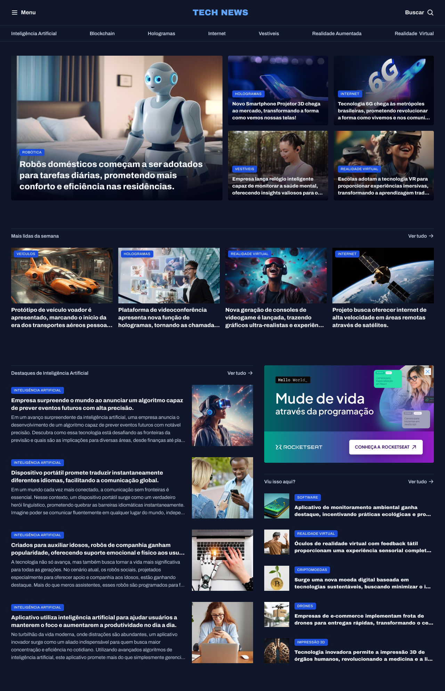

# Tech News Page

A simple news page using HTML and CSS. Focusing in Grid Layout.

     <a href="https://tech-news-page.netlify.app/">📱 Visit this Project</a> 
     <a href="https://www.figma.com/design/SYGqKvGAMHZuLywi5HE94J/Portal-de-not%C3%ADcias-(Community)?node-id=3-376&p=f&t=z0TKDAH9Nys8JCCm-0">🎨 Figma</a>

    

## Tech Stack

